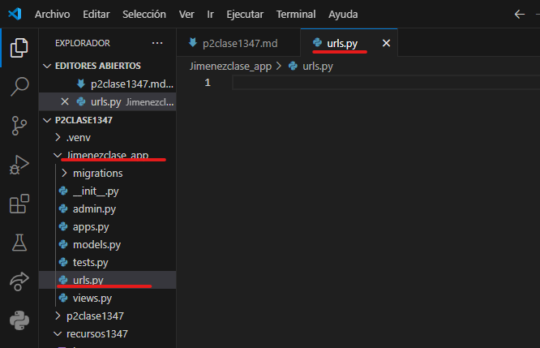
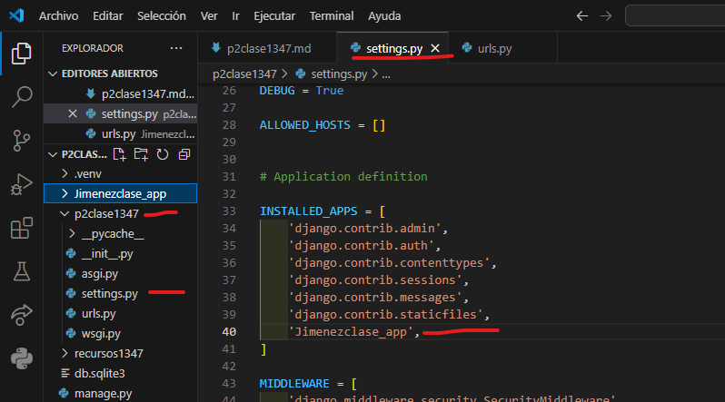
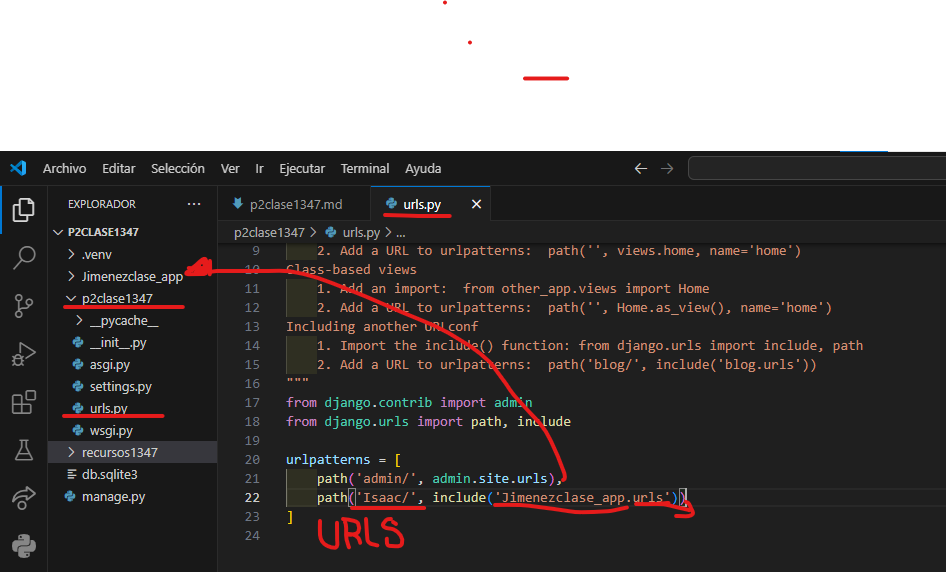
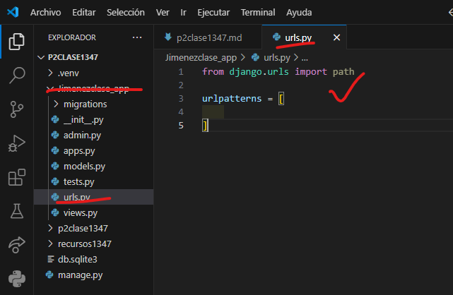
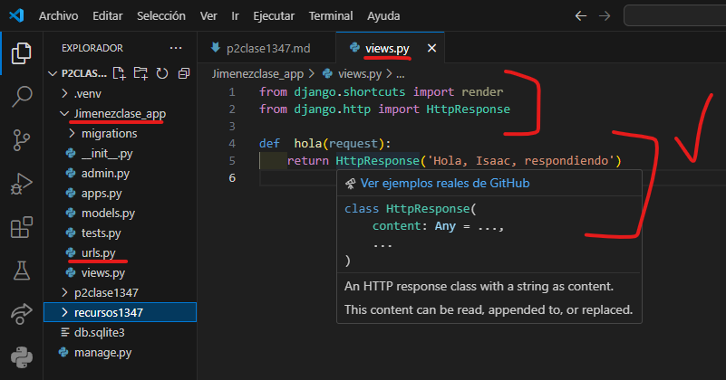
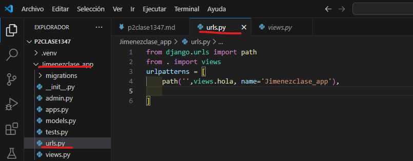

- crear aplicacion Jimenezclase_app
- comandoo --> python manage.py startapp Jimenezclase_app
- creamos el archivo urls.py en Jimenezclase_app
- 
- En setting.py de p2clase1347
- 
- en urls.py de p2clase1347
- 
- en urls.py de Jimenezclase_app
- 
- en views.py de Jimenezclase_app
- 
- en urls.py de Jimenezclase_app
- 
- 
 